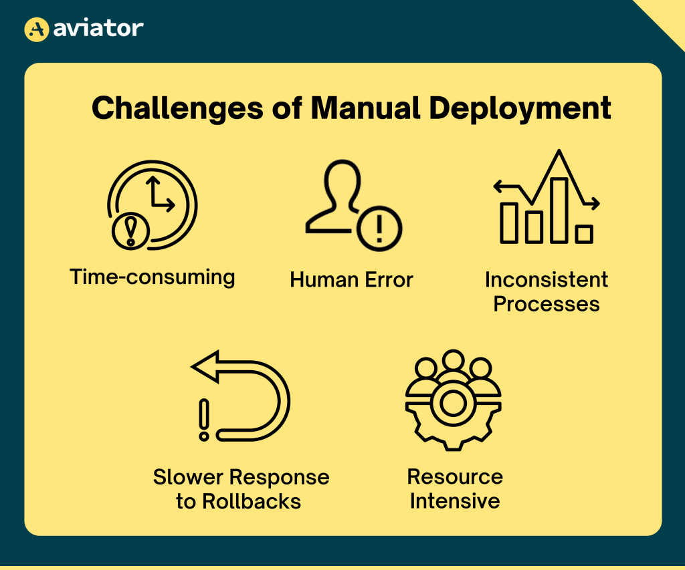

# Before Docker 

- Development, testing and operatons team works in different environment.
- Due to which different issue arise due to separated way of installation and configurations of the system used by different teams

- The solution to address the above problem is the introduction of **Docker**. Docker virtualize the application.
- However to run the virtualization, it needs a **Hypervisor**. The hypervisor is an application which enables us to segregate the hardware resource and provision them to a virtual machine.
- 

# Docker 

- Docker is a container based plateform that makes it easier to build and deploy and run the application.
- Docker uses a client - server architecture where the client communicates with a background daemon to manage continers, image and others.
- 
- 