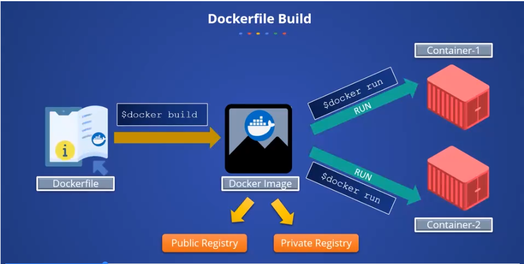

## What is a Dockerfile
- A Dockerfile is a text file containing a set of instructions or commands that Docker uses to automatically build an image.
- It allows custom creation of images by specifying steps such as installing software on a base image like Ubuntu or CentOS.
- Docker can build images automatically by ​reading the instructions we ​have provided in the Docker file
- 

## Structure and Usage of Dockerfile
- Dockerfile contains all of the commands that a user may use to create an image from the command line.
- Instructions in a Dockerfile are called directives, usually written in uppercase for clarity, and can be commented using a hash (#).
- Each instruction adds a new layer on top of the base image, resulting in a new image version as the Dockerfile evolves.

## Building and Using Docker Images
- The main purpose of a Dockerfile is to create custom images tailored to specific application requirements
- After writing a Dockerfile, the image is built using the "docker build" command, and containers can be created from the image using "docker run".

### Question : What is the purpose of each instruction in a Dockerfile?
Each instruction (or directive) in a Dockerfile serves a specific purpose to define how the Docker image is built. Below are the common purpose of dockerfile instruction : 
- FROM: Specifies the base image to start from
- RUN: Executes commands inside the image, such as installing software or configuring settings.
- COPY or ADD: Copies files or directories from your local machine into the image.
- CMD: Defines the default command to run when a container starts from the image.
- EXPOSE: Indicates which network ports the container will listen on.
- ENV: Sets environment variables inside the image.
- WORKDIR: Sets the working directory for subsequent instru
ctions.
- ENTRYPOINT: Configures a container to run as an executable.

### Question :How does layering in Docker images affect image creation and updates?
Layering in Docker images means that each instruction in a Dockerfile creates a new layer on top of the previous ones. This has two main effects:
- Efficiency in Image Creation: When building an image, Docker reuses existing layers if they haven't changed, so it doesn't redo all steps every time. This speeds up the build process.
- Updates and Changes: If you modify an instruction, Docker only rebuilds that layer and the onesOptimizing Build with .dockerignore

    A .dockerignore file can be used to exclude files or directories from the build context.
    This improves build efficiency by preventing unnecessary files from being sent to the Docker daemon.

Image Usage

    Once built, the Docker image can be pushed to a public or private registry.
    Containers can be created from the image using Docker run, allowing multiple containers from the same image. after it, not the entire image. This makes updating images faster and more efficient.

## Creating Dockerfile.
Key Dockerfile Instructions
- The first instruction is "FROM" to specify the base image from which the Docker image will start.
- The "MAINTAINER" instruction specifies the name of the developer creating the Dockerfile.

```Dockerfile
FROM ubuntu
MAINTAINER Tashi
RUN apt-get update
CMD ["echo", "This is the basic image"]
```
### Question : What is the purpose of the FROM instruction in a Dockerfile
The purpose of the FROM instruction in a Dockerfile is to specify the base image from which the Docker image will start. It sets the starting point for building any custom image by selecting an existing image as the foundation.

### Question : What is the role of the MAINTAINER instruction in a Dockerfile?
The MAINTAINER instruction in a Dockerfile specifies the name of the person or developer responsible for creating and maintaining the Dockerfile. Technically it helpsOptimizing Build with .dockerignore

    A .dockerignore file can be used to exclude files or directories from the build context.
    This improves build efficiency by preventing unnecessary files from being sent to the Docker daemon.

Image Usage

    Once built, the Docker image can be pushed to a public or private registry.
    Containers can be created from the image using Docker run, allowing multiple containers from the same image. to identify who created or manages the docker image. 

## Benifits of Dockerfile


- Automation : Dockerfile allows us to automate the docker images via a script. Automates Docker image creation through scripting, avoiding manual and complex setups across different operating systems.
- Easy versioning : Provides a clear, step-by-step method for building images, making configurations easy to understand and maintain with version control.
- Shareable : once a dockerfile is created the Dockerfile it can be shared among team and organization. ​So this means Dockerfile allows us a flexible ​management of entire Docker images.

## Dockerfile use case 
- Primarily used to create Docker images and containers efficiently from a single source.
- Solves the problem of maintaining multiple images for different environments by using one Dockerfile to build images as ne
eded, saving storage space and simplifying management.
  
### Question 1 : Which of the following are benefits of using a Dockerfile for optimizing deployment processes?
- It automatically resolves all software conflicts

- **It allows for version control of Docker images**

- ***It allows for the selective inclusion of components in a Docker image**

- **It allows for the automation of Docker image creation**

- It provides real-time monitoring of Docker containers
  
### Question 2 : What is one significant benefit of using a Dockerfile in the deployment process?

- It provides a detailed log of all system events

- It automatically updates all software dependencies

- It ensures the Docker container is compatible with all operating systems

- **It reduces the size of the final Docker image**

## Dockerfile Build Optimizing Build with .dockerignore

    A .dockerignore file can be used to exclude files or directories from the build context.
    This improves build efficiency by preventing unnecessary files from being sent to the Docker daemon.

Image Usage

    Once built, the Docker image can be pushed to a public or private registry.
    Containers can be created from the image using Docker run, allowing multiple containers from the same image.
- The workflow to create ​a Docker image from a Dockerfile is, ​once create the Dockerfile, ​use the Docker command Docker build to create the image.
```Dockerfile
docker build
```
- Once the Docker image is ​pushed or saved in the private or public registry
```Dockerfile
docker push <image tag>
```
- We can use Docker run to create ​a container by specifying ​the image that we have created, ​and you know that from the same image, ​we can create multiple containers. 
```Dockerfile
docker run <image tag>
```


## Docker build - syntax 
- The syntax of docker build is docker build, the options, path of the dockerfile. The additional options like path and URL defines the path of the dockerfile or a URL where the dockerfile is saved. 
```dockerfile
docker build [options] path | url | -
```
Optimizing Build with .dockerignore
- A .dockerignore file can be used to exclude files or directories from the build context.
- This improves build efficiency by preventing unnecessary files from being sent to the Docker daemon.

Image Usage
- Once built, the Docker image can be pushed to a public or private registry.
- Containers can be created from the image using Docker run, allowing multiple containers from the same image.

## Docker Commands
- To create and start a new docker container in a detached mode we use 
```Dockerfile
docker run -d --name <container name>
```
- To build docker image from dockerfile in the current directory 
```Dockerfile
docker build -t <image name>
```
- To download a docker image from a docker registry to the local machine.
```Dockerfile
docker pull <image name>
```
- To push a docker image from the local machine to the docker registry
```Dockerfile
docker push <image name>
```
- To list all the running docker containers 
```Dockerfile
docker ps
```
- To list all the docker images stored on the local machine
```Dockerfile
docker images
```
- To stop a running docker container 
```Dockerfile
docker stop <container name>
```
- To start the stopped docker container 
```Dockerfile
docker start <continer name>
```
- To removes one or more docker container
```Dockerfile
docker rm <container name>
```
- To remove one or more docker images from the local machine
```Dockerfile
docker rmi <image name>
```

### Question 1 : You are tasked to create a Docker image using Dockerfile. Which of the following commands should you use?
- docker run build
- docker create build
- **docker build .**
- docker compose build

### Question 2 : Which of the following statements are true regarding Dockerfile instructions?
- The FROM instruction initializes a new build stage and sets the Base Image for subsequent instructions.

- **The RUN instruction will run any commands in a new layer on top of the current image and commit the results.**

- **The COPY instruction copies new files from source and adds them to the filesystem of the container at the path.**
Nice work

- **The CMD instruction provides defaults for an executing container which can include an executable.**

